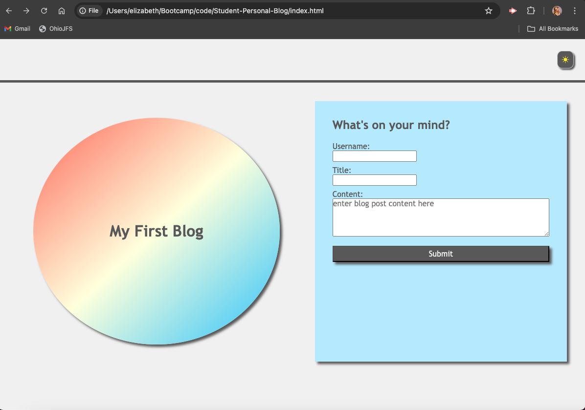
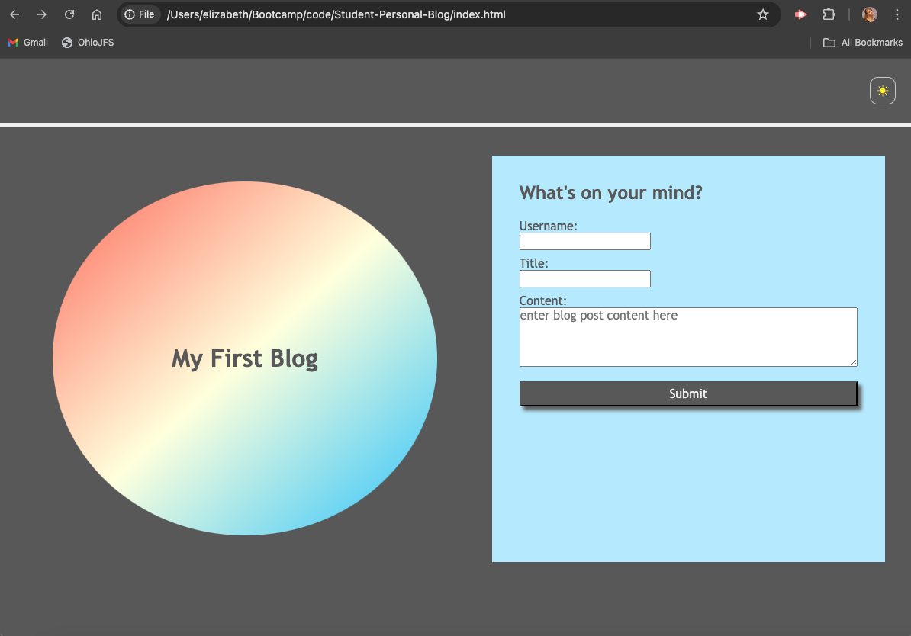
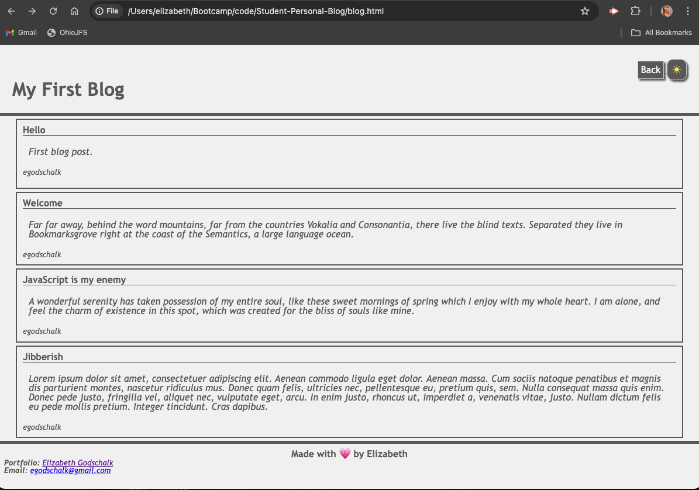

# Personal Blog

## Description

This application is a basic 2-page blog site where a user can enter blog posts and view them on a separate page. It allows for dark mode and light mode. 

## Deployed Site

https://egodschalk.github.io/Student-Personal-Blog

## GitHub Repo

https://github.com/egodschalk/Student-Personal-Blog

## Screenshots

